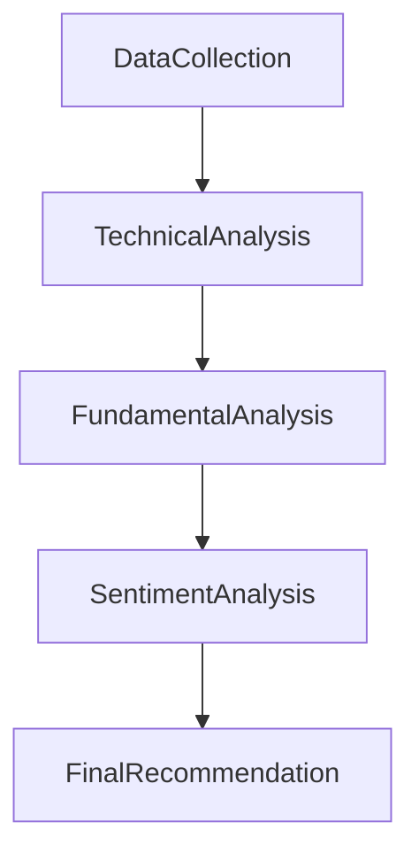

# PydanticAI Stock Analyst with MCP Integration

This project integrates the TODO stock analyst (which uses MCP approach) into a proper PydanticAI graph structure for orchestrated multi-stage stock analysis.

## 🚀 Features

- **PydanticAI Graph Workflow**: Multi-stage analysis pipeline with state management
- **MCP Integration**: Model Context Protocol for external data access (Alpha Vantage)
- **Comprehensive Analysis**: Technical, Fundamental, and Sentiment analysis
- **Type-Safe Data Models**: Full Pydantic integration for data validation
- **FastAPI Endpoints**: RESTful API with automatic documentation
- **Workflow Visualization**: Mermaid diagrams for process visualization
- **Background Processing**: Async task support for long-running analyses

## 🏗️ Architecture

The system uses a **PydanticAI Graph** with the following nodes:



### Graph Nodes

1. **DataCollection**: Uses MCP to gather stock data from Alpha Vantage
2. **TechnicalAnalysis**: Analyzes price patterns, trends, and indicators
3. **FundamentalAnalysis**: Evaluates company financials and valuation
4. **SentimentAnalysis**: Assesses market sentiment and news impact
5. **FinalRecommendation**: Synthesizes all analyses into investment recommendation

### State Management

The `StockAnalysisState` dataclass flows through all nodes, accumulating:

- Raw stock data points
- Analysis results from each stage
- User profile and preferences
- Agent message history
- Market conditions assessment

## 📦 Installation

### Dependencies

```bash
# Core PydanticAI dependencies
pip install pydantic-ai-slim[anthropic,mcp]
pip install pydantic-graph
pip install logfire

# Additional dependencies
pip install aiohttp pandas
```

### Environment Variables

```bash
# Required for MCP stock data access
export ALPHA_VANTAGE_API_KEY="your_alpha_vantage_key"
export ANTHROPIC_API_KEY="your_anthropic_key"

# Optional: Custom MCP server path
export MCP_STOCK_SERVER_PATH="/path/to/stock-mcp-server/dist/index.js"
```

## 🎯 Usage

### Basic Stock Analysis

```python
from app.agents.pydantic_ai_stock_analyst import PydanticAIStockAnalyst, UserProfile

# Create analyst instance
analyst = PydanticAIStockAnalyst()

# Define user profile
user = UserProfile(
    name="John Investor",
    risk_tolerance="moderate",
    investment_horizon="long"
)

# Run analysis
result = await analyst.analyze_stock("AAPL", user)

print(f"Recommendation: {result.recommendation}")
print(f"Confidence: {result.confidence}")
print(f"Target Price: ${result.target_price}")
```

### API Endpoints

#### 1. Comprehensive Analysis

```bash
POST /stock-analysis/analyze
{
    "symbol": "AAPL",
    "user_profile": {
        "name": "John Investor",
        "risk_tolerance": "moderate",
        "investment_horizon": "long"
    }
}
```

#### 2. Workflow Visualization

```bash
GET /stock-analysis/workflow-diagram
```

#### 3. Analysis Steps

```bash
GET /stock-analysis/workflow-steps/AAPL
```

#### 4. Background Analysis

```bash
POST /stock-analysis/analyze-async
{
    "symbol": "TSLA"
}
```

### Response Example

```json
{
  "success": true,
  "analysis_result": {
    "symbol": "AAPL",
    "recommendation": "buy",
    "confidence": 0.85,
    "target_price": 185.0,
    "stop_loss": 140.0,
    "reasoning": "Strong technical momentum with bullish sentiment...",
    "market_conditions": {
      "sentiment": "bullish",
      "volatility": "medium",
      "trend": "upward",
      "confidence": 0.75
    },
    "data_points": [
      {
        "date": "2024-12-07",
        "symbol": "AAPL",
        "open_price": 150.0,
        "high_price": 152.0,
        "low_price": 148.0,
        "close_price": 151.0,
        "volume": 1000000,
        "daily_change": 1.5,
        "daily_change_pct": 1.0
      }
    ],
    "analysis_timestamp": "2024-12-07T12:00:00Z"
  },
  "execution_time_seconds": 45.2
}
```

## 🔧 Technical Implementation

### PydanticAI Integration

The implementation showcases several PydanticAI features:

1. **Graph Nodes**: Each analysis stage is a `BaseNode` subclass
2. **State Management**: `StockAnalysisState` flows through the graph
3. **Type Safety**: All data structures use Pydantic models
4. **Agent Orchestration**: Multiple specialized agents for different analysis types
5. **MCP Integration**: External data sources via Model Context Protocol

### MCP (Model Context Protocol)

The MCP integration allows agents to:

- Access real-time stock data from Alpha Vantage
- Pull historical price information
- Retrieve market data and indicators
- Maintain data consistency across analysis stages

### Graph Execution

```python
# Graph definition
stock_analysis_graph = Graph(
    nodes=[DataCollection, TechnicalAnalysis, FundamentalAnalysis, SentimentAnalysis, FinalRecommendation],
    state_type=StockAnalysisState
)

# Execution
result = await stock_analysis_graph.run(DataCollection(), state=initial_state)
```

## 🧪 Testing

### Test the Workflow

```bash
# Test the PydanticAI integration
curl http://localhost:8000/test-workflow

# Health check
curl http://localhost:8000/stock-analysis/health

# Basic analysis
curl -X POST http://localhost:8000/stock-analysis/analyze \
  -H "Content-Type: application/json" \
  -d '{"symbol": "AAPL"}'
```

### Running the Server

```bash
cd server
python -m uvicorn app.main:app --host 0.0.0.0 --port 8000 --reload
```

## 🔍 Debugging

### View Analysis Steps

```python
# Get step-by-step execution
steps = await analyst.get_analysis_steps("AAPL")
for step in steps:
    print(step)
```

### Workflow Visualization

```python
# Generate Mermaid diagram
diagram = analyst.generate_mermaid_diagram()
print(diagram)
```

## 🚧 Extending the System

### Adding New Analysis Nodes

```python
@dataclass
class NewsAnalysis(BaseNode[StockAnalysisState]):
    """Additional node for news analysis"""

    async def run(self, ctx: GraphRunContext[StockAnalysisState]) -> NextNode:
        # Your analysis logic here
        result = await news_agent.run(f"Analyze news for {ctx.state.symbol}")
        ctx.state.news_analysis = result.output
        return NextNode()
```

### Custom User Profiles

```python
class CustomUserProfile(UserProfile):
    """Extended user profile with additional fields"""
    investment_amount: float
    sectors_of_interest: List[str]
    esg_preference: bool = False
```

### Alternative Data Sources

The MCP architecture makes it easy to integrate additional data sources:

- News APIs (NewsAPI, Finnhub)
- Social sentiment (Twitter, Reddit)
- Economic indicators (FRED, BEA)
- Alternative data (satellite, web scraping)

## 🎨 Frontend Integration

The API provides all necessary endpoints for building rich frontend experiences:

- Real-time analysis progress via WebSockets (future enhancement)
- Interactive workflow diagrams
- Historical analysis results
- Portfolio tracking and alerts

## 📈 Performance Considerations

- **Async Execution**: All nodes run asynchronously
- **Background Tasks**: Long analyses can run in background
- **Caching**: Results can be cached for repeated queries
- **Rate Limiting**: MCP calls respect API rate limits
- **Error Handling**: Graceful degradation when services are unavailable

## 🔐 Security

- API key management via environment variables
- Input validation via Pydantic models
- Rate limiting on analysis endpoints
- Secure MCP server communication

## 📊 Monitoring

The system includes comprehensive logging and monitoring:

- **Logfire Integration**: Structured logging for all operations
- **Health Checks**: Service availability monitoring
- **Performance Metrics**: Execution time tracking
- **Error Tracking**: Detailed error reporting and recovery

## 🤝 Contributing

To extend this implementation:

1. Add new analysis nodes following the `BaseNode` pattern
2. Extend data models with additional Pydantic classes
3. Create new MCP integrations for additional data sources
4. Implement new API endpoints following the existing patterns

## 📚 Resources

- [PydanticAI Documentation](https://ai.pydantic.dev/)
- [Pydantic Documentation](https://docs.pydantic.dev/)
- [Model Context Protocol (MCP)](https://modelcontextprotocol.io/)
- [FastAPI Documentation](https://fastapi.tiangolo.com/)

## 🏆 Key Benefits

1. **Type Safety**: Full type checking throughout the pipeline
2. **Modularity**: Each analysis stage is independent and testable
3. **Scalability**: Easy to add new analysis types or data sources
4. **Maintainability**: Clean separation of concerns
5. **Observability**: Comprehensive logging and monitoring
6. **Flexibility**: Support for different user profiles and analysis types

This implementation demonstrates how to effectively combine PydanticAI's graph functionality with the MCP approach for building sophisticated, production-ready AI applications.
